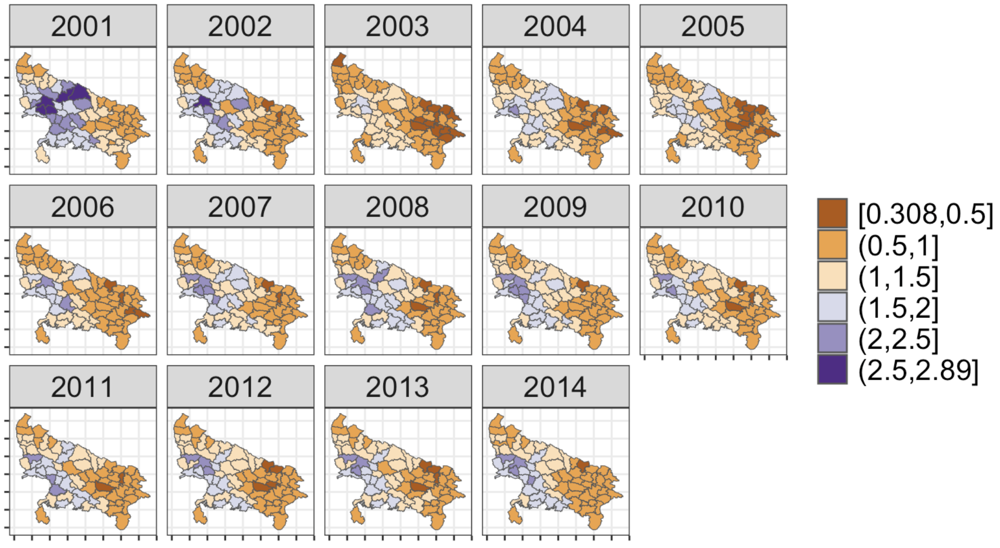

# Bayesian Spatio-Temporal Modeling of Gender-Based Violence in Uttar Pradesh

This project presents a Bayesian spatio-temporal analysis of crimes against women across 70 districts in Uttar Pradesh, India, from 2001 to 2014. We apply Bayesian Hierarchical Models (BHMs) to capture structured and unstructured latent risk patterns in spatial and temporal dimensions. 

**Background & relevance**: This work builds on and extends the methodology of Vicente et al. (2018, 2020), who modeled gender-based violence in India using spatial statistics. Our model formulation and robust inference pipeline demonstrate how Bayesian spatio-temporal models can be used to inform targeted policy interventions—especially in underreported and socially sensitive domains.

## Overview 
We apply Bayesian Hierarchical Models (BHMs) with:

-  [Besag–York–Mollié 2 (BYM2) priors](https://arxiv.org/abs/1601.01180) to disentangle structured and unstructured variation in spatial and temporal domains.
- First-order random walks for temporal trends.
- Type I space-time interactions to capture district-specific deviations from global temporal trends.

## Methodology Highlights
- **Model Types**: Spatial (S), Spatio-Temporal (ST), and Spatio-Temporal with Interaction (ST+I).
- **Likelihood**: Poisson models with expected counts as offsets.
- **Inference**: Bayesian model fitting performed via Integrated Nested Laplace Approximation (INLA) for computationally efficient, fully probabilistic inference.
- **Priors**: Penalised Complexity (PC) priors on all hyperparameters to avoid overfitting.
- **Model Comparison**: WAIC was used for model selection and sensitivity analysis across three prior settings.

## Key Results
- **Spatial heterogeneity**: Clear and distinct regional clustering was observed for the two event types, with persistent high-risk zones concentrated in specific districts across the state.
- **Temporal divergence**: One event type showed a marked increase in relative risk after a key inflection point in 2012, while the other remained temporally stable throughout the study period.
- **Space–time interaction**: Incorporating Type I interaction terms significantly improved model fit (lower WAIC), revealing district-specific deviations from global temporal trends that would be missed by additive models alone.
- **Model robustness**: Sensitivity analyses across three prior configurations demonstrated consistent posterior estimates and model selection outcomes, supporting the reliability of inference under varying prior assumptions.
- **Policy implications**: The models provided stable, smoothed risk estimates even in data-sparse districts, highlighting the utility of Bayesian spatio-temporal methods for guiding geographically targeted interventions in complex social data contexts.

### Posteror mean relative risks of crimes against women from ST+I model

